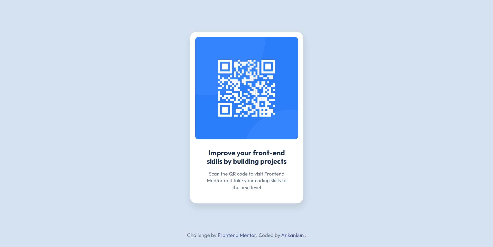

# Frontend Mentor - QR code component solution

This is a solution to the QR code component challenge on Frontend Mentor. Frontend Mentor challenges help you improve your coding skills by building realistic projects.

## Table of contents

- [Overview](#overview)
  - [Screenshot](#screenshot)
  - [Links](#links)
- [My process](#my-process)
  - [Built with](#built-with)
  - [What I learned](#what-i-learned)
  - [Continued development](#continued-development)
  - [Useful resources](#useful-resources)
- [Author](#author)
- [Acknowledgments](#acknowledgments)

## Overview

### Screenshot

### Links

- Solution URL: https://github.com/Ankankun/QR-Code-Component
- Live Site URL: https://ankankun.github.io/QR-Code-Component/

## My process

### Built with

- Semantic HTML5 markup
- CSS custom properties
- Figma design workflow

### What I learned

This project reinforced core layout skills for small, card-like components.

- Centering content with margin auto on the page body
- Using rounded corners and subtle box shadows to match a design
- Keeping consistent spacing and typography for readability

### Continued development

- Refine color/spacing scales using CSS variables
- Try responsive type with `clamp()`
- Explore extracting this as a reusable component pattern
- QR Code Integration with My own Portfolio.

### Useful resources

- https://developer.mozilla.org/en-US/docs/Web/CSS/

## Author

- Website - [Ankan Das] https://www.your-site.com
- Frontend Mentor — [@Ankankun] https://www.frontendmentor.io/profile/Ankankun
- GitHub — https://github.com/Ankankun

## Acknowledgments

I deeply acknowledge Internet as a whole for having such abundance of resources to learn Web Development for free. Youtube, Freecodecamp and Frontend Mentor.
